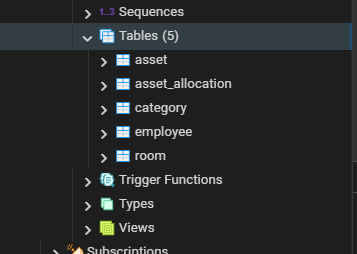
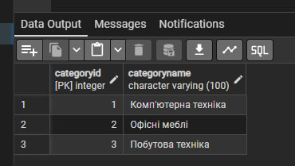
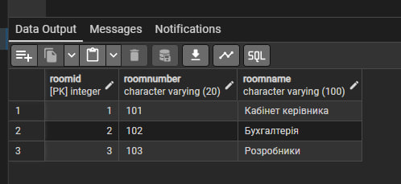
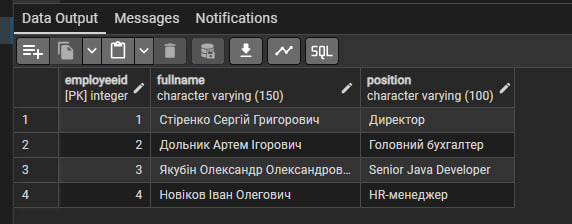
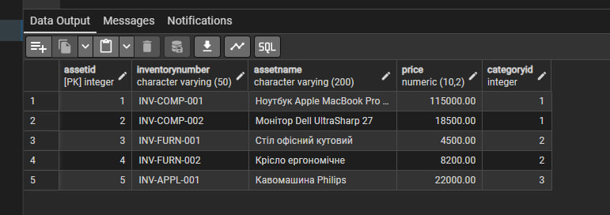
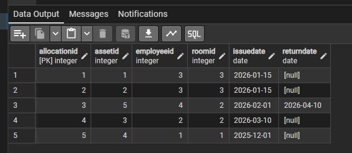

# Лабораторна робота №2: DDL (Data Definition Language)

**Тема:** Система електронного обліку майна.

**Мета:** Перенести розроблену ER-модель у фізичну базу даних PostgreSQL, створити таблиці, налаштувати зв'язки та обмеження, а також заповнити базу тестовими даними.

---

## 1. Короткий опис реляційної схеми

База даних складається з 5 взаємопов'язаних таблиць, розроблених у 3-й нормальній формі:

1. **Category (Категорії):** Довідник категорій майна. `CategoryID` — первинний ключ.
2. **Room (Приміщення):** Довідник кабінетів. `RoomID` — первинний ключ.
3. **Employee (Співробітники):** Довідник персоналу з ПІБ та посадами. `EmployeeID` — первинний ключ.
4. **Asset (Майно):** Основна таблиця. `AssetID` (PK). Посилається на категорію `CategoryID` (FK). Має обмеження `UNIQUE` на інвентарний номер та `CHECK (Price >= 0)`.
5. **Asset_Allocation (Журнал обліку):** Асоціативна таблиця. Поєднує майно, співробітника та приміщення. Має обмеження `CHECK (ReturnDate IS NULL OR ReturnDate >= IssueDate)`.

---

## 2. SQL Скрипти

Файли з повним кодом знаходяться в репозиторії:
* 📄 [`Tables.sql`](./Tables.sql) — створення схеми та обмежень.
* 📄 [`Insert.sql`](./Insert.sql) — заповнення таблиць тестовими даними (по 3-5 рядків).

<details>
<summary>Натисніть, щоб розгорнути код DDL (Створення таблиць)</summary>

```sql
CREATE TABLE Category (
    CategoryID INT PRIMARY KEY,
    CategoryName VARCHAR(100) NOT NULL
);

CREATE TABLE Room (
    RoomID INT PRIMARY KEY,
    RoomNumber VARCHAR(20) NOT NULL,
    RoomName VARCHAR(100) NOT NULL
);

CREATE TABLE Employee (
    EmployeeID INT PRIMARY KEY,
    FullName VARCHAR(150) NOT NULL,
    Position VARCHAR(100) NOT NULL
);

CREATE TABLE Asset (
    AssetID INT PRIMARY KEY,
    InventoryNumber VARCHAR(50) UNIQUE NOT NULL,
    AssetName VARCHAR(200) NOT NULL,
    Price DECIMAL(10, 2) CHECK (Price >= 0),
    CategoryID INT NOT NULL,
    FOREIGN KEY (CategoryID) REFERENCES Category(CategoryID)
);

CREATE TABLE Asset_Allocation (
    AllocationID INT PRIMARY KEY,
    AssetID INT NOT NULL,
    EmployeeID INT NOT NULL,
    RoomID INT NOT NULL,
    IssueDate DATE NOT NULL,
    ReturnDate DATE,
    FOREIGN KEY (AssetID) REFERENCES Asset(AssetID),
    FOREIGN KEY (EmployeeID) REFERENCES Employee(EmployeeID),
    FOREIGN KEY (RoomID) REFERENCES Room(RoomID),
    CHECK (ReturnDate IS NULL OR ReturnDate >= IssueDate)
); 
```
</details>

## 3. Результати виконання:
 [Переглянути всі скріншоти у папці](./screenshots/)

 ####

 
 #### Таблиця Category 


#### Таблиця Category 


#### Таблиця Room 


#### Таблиця Employee 


#### Таблиця Asset 


#### Таблиця Asset_Allocation 

## 4. Висновки

У результаті виконання лабораторної роботи:
* ER-діаграма була успішно перетворена у реляційну схему,
* реалізовано таблиці з первинними та зовнішніми ключами,
* використано обмеження `CHECK`, `UNIQUE` та `NOT NULL` для забезпечення цілісності даних,
* схема протестована на коректність у PostgreSQL.
